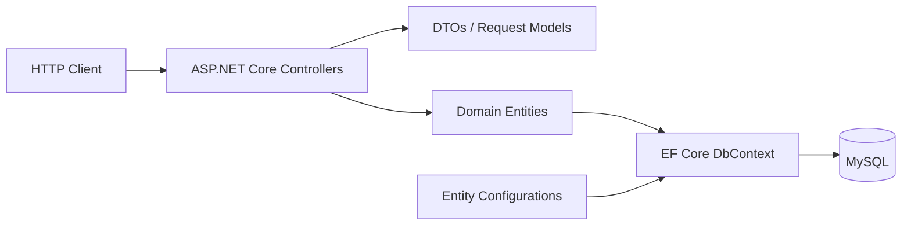

# Architecture

## Overview

Central Pessoa is a REST API for managing person-related data such as individuals, companies, addresses and phone information.

The project uses a straightforward layered structure suitable for a portfolio API while keeping persistence concerns separate from HTTP endpoints.



## Main responsibilities

### Controllers

Controllers expose the REST endpoints and coordinate application behavior.

They are responsible for:

- receiving HTTP requests;
- validating basic request flow;
- loading and updating entities through EF Core;
- returning HTTP responses.

### DTOs

DTOs define transport-focused representations used by the API.

This avoids coupling the external HTTP contract directly to every internal persistence concern.

### Domain entities

The project models concepts including:

- person;
- individual;
- company;
- address;
- phone;
- phone type;
- parent-related information.

### Persistence

Persistence is implemented using:

- Entity Framework Core;
- `CentralPessoaContext`;
- explicit `IEntityTypeConfiguration<T>` mappings;
- MySQL through `MySql.EntityFrameworkCore`.

## Configuration

Database credentials are not stored in tracked source configuration.

The connection string is supplied using:

- environment variables; or
- .NET user-secrets for local development.

Expected configuration key:

```text
ConnectionStrings__DefaultConnection
```

## Startup

The application validates that a connection string exists before configuring the DbContext.

For this portfolio project, the database schema is initialized at startup with `EnsureCreated()`.

For a larger production system, I would prefer a controlled migration/deployment strategy rather than schema creation as an application-startup responsibility.

## API documentation

Swagger/OpenAPI is available in the development environment.

## CI

GitHub Actions restores and builds the solution using .NET 10 for changes targeting the main branch.

## Modernization

The project was originally built on .NET 7 and modernized to .NET 10.

Key modernization work included:

- .NET 10 target framework;
- current MySQL EF Core provider;
- removal of tracked database credentials;
- removal of database side effects from the DbContext constructor;
- updated OpenAPI dependencies;
- CI validation before merge.

See [ADR-0001](adr/0001-modernize-to-dotnet-10.md).
